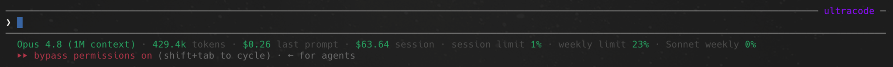

# ccbar (Claude Code info bar)

A small, fast, **single-line** status bar that lives just below the Claude Code
input box. It shows, at a glance:



Reading the bar left to right — each segment from the screenshot above:

```
Opus 4.8 (1M context) · 429.4k tokens · $0.26 last prompt · $63.64 session · session limit 1% · weekly limit 23% · Sonnet weekly 0%
```

| Segment                  | What it means |
| ------------------------ | ------------- |
| `Opus 4.8 (1M context)`  | Active model and its context-window size (from Claude Code's model name) |
| `429.4k tokens`          | **Tokens used in the last prompt** — input + output + cache read/write |
| `$0.26 last prompt`      | **API-equivalent cost of the last prompt** — what it would have cost on an API key |
| `$63.64 session`         | **API-equivalent cost of the whole session** so far |
| `session limit 1%`       | **Current session usage** — your rolling 5-hour limit |
| `weekly limit 23%`       | **Weekly usage** — the 7-day, all-models limit |
| `Sonnet weekly 0%`       | **Per-model weekly usage** ("all models limits") — one row per model bucket the API reports (here, only Sonnet is active) |

Values are shown in **green**; a limit percentage turns **amber at ≥70%** and
**red at ≥90%** so pressure is easy to spot. On a narrow terminal the
lowest-priority segments are dropped so the bar **never wraps**. Prefer terse
labels (`5h`, `wk`, `tok`)? Set `"compact_labels": true`.

Built in Go with **zero dependencies** — a single native binary, cold-start in
milliseconds, no interpreter, no transcript parsing on the render path.

---

## Requirements

- **Go** ≥ 1.21 (to build).
- **Claude Code** — field shapes verified on **2.1.190**. The limit segments need a
  recent 2.1.x that emits `rate_limits` in the statusLine payload (introduced
  around 2.1.80); on older builds those segments simply don't render.
- A **Pro/Max** subscription for the limit segments (they come from your plan's
  rate limits; an API-key-only setup will simply omit them).

## Install

Every method ends with `ccbar install`, which registers the binary in
`~/.claude/settings.json` (preserving your other settings, with a backup). The bar
appears on your next interaction — no restart needed.

**curl | sh** (macOS/Linux, no Go required — downloads a prebuilt binary):

```bash
curl -fsSL https://raw.githubusercontent.com/sayginsaman/ccbar/main/install.sh | sh
```

**Homebrew** (macOS/Linux):

```bash
brew install sayginsaman/tap/ccbar
ccbar install
```

**go install** (any platform with Go):

```bash
go install github.com/sayginsaman/ccbar@latest
ccbar install
```

**From source** (clone, then):

```bash
make install        # go build + ccbar install
```

Verify and inspect the live data anytime:

```bash
ccbar --doctor
```

> Releasing: publish a GitHub release + Homebrew tap so the prebuilt curl/brew
> installs work — see [RELEASING.md](RELEASING.md). Until then, the installer
> automatically falls back to building from source (needs Go + git).

The status line refreshes on events; `ccbar install --refresh-interval N` (default
30s) also re-renders while the session is idle (e.g. waiting on background agents).
The usage endpoint is still only polled once per cache TTL.

## Where the data comes from

Four of the five metrics need **no network call and no credentials** — Claude Code
already passes them to the statusLine program on stdin:

- last-prompt tokens ← `context_window.current_usage`
- session cost ← `cost.total_cost_usd` (Claude Code's own estimate)
- last-prompt cost ← computed from `current_usage` × an embedded price table
- session (5h) & weekly (7d) limits ← `rate_limits.{five_hour,seven_day}`

The only exception is **per-model weekly limits** ("all models limits"), which are
not in the stdin payload. ccbar reads them from the same authenticated endpoint the
`/usage` command uses (`GET /api/oauth/usage`), and handles it conservatively:

- **Read-only on credentials.** It reads your existing Claude Code OAuth token from
  `~/.claude/.credentials.json`. It never writes, refreshes, or logs the token.
- **Never blocks the bar.** The render path only reads a local cache
  (`~/.claude/ccbar/usage-cache.json`, ~60s TTL). When the cache is stale it kicks
  off a **detached background refresh** and renders immediately from what it has.
- **Degrades gracefully.** No token / offline / expired / schema change → the
  per-model segments simply don't appear; everything else keeps working.
- **Fully optional.** Set `"usage_endpoint": false` in the config for a pure-stdin
  bar (session + weekly limits only, no per-model, no network).

The cache stores only percentages and reset times — never the token.

## Configuration

`~/.claude/ccbar/config.json` (all fields optional; defaults shown):

```json
{
  "style": "text",
  "color": true,
  "ascii": false,
  "compact_labels": false,
  "warn_threshold": 70,
  "crit_threshold": 90,
  "segments": {
    "model": true,
    "tokens": true,
    "cost_last": true,
    "cost_session": true,
    "five_hour": true,
    "seven_day": true,
    "per_model": ["Opus", "Sonnet"],
    "context": false
  },
  "hide_zero_per_model": false,
  "usage_endpoint": true,
  "keychain": false,
  "cache_ttl_seconds": 60,
  "plan": "auto",
  "show_plan": false,
  "show_resets_when_hot": false
}
```

- `ascii` — use `|` separators and ASCII markers instead of `·`/`↻`.
- `compact_labels` — terse labels (`5h`, `wk`, `tok`, bare `$0.25`) instead of the
  default full phrases (`session limit`, `weekly limit`, `tokens`, `… last prompt`).
- `per_model` — which per-model weekly limits to show, in order (by display name).
- `hide_zero_per_model` — omit per-model weekly limits that are sitting at 0%.
- `keychain` — if the credentials-file token is expired, fall back to the macOS
  Keychain (may prompt once). Off by default; the file token is normally kept fresh
  by Claude Code itself.
- `plan` — `"auto"` detects the tier from `~/.claude.json`; or set an explicit
  label like `"Max 20x"`. Shown only when `show_plan` is true.
- `show_resets_when_hot` — append a reset countdown (e.g. `↻2h`) to a limit once it
  crosses the warn threshold.

Prices can be overridden without recompiling via `~/.claude/ccbar/pricing.json`
(same shape as the built-in table, USD per million tokens).

## Troubleshooting

- **Limits missing?** They appear only after the first API response of a session,
  and only on Pro/Max accounts. Run `--doctor` to see the live values.
- **Per-model shows fewer than expected?** A bucket that is `null` on your account
  (e.g. no separate Opus weekly cap active) is hidden by design.
- **Bar is blank?** Run `~/.claude/ccbar/ccbar --doctor`. Note that an empty
  payload (`echo '{}' | ccbar`) omits all stdin-derived segments but may still show
  cached per-model limits; for a truly empty render use a clean home, e.g.
  `echo '{}' | HOME=$(mktemp -d) ~/.claude/ccbar/ccbar`. A non-zero exit or empty
  stdout blanks the status line by design.
- **Privacy of `--doctor`:** its output includes your plan tier and the token
  expiry time (never the token itself). Redact those before pasting into a bug report.
- **Colors look wrong / want none?** Set `NO_COLOR=1` or `"color": false`.

## Commands

```
ccbar                 render the bar (reads stdin) — Claude Code calls this
ccbar install         register as the status line (edits settings.json, with backup)
ccbar uninstall       remove from settings.json (--purge also deletes the data dir)
ccbar --doctor        diagnostics + a read-only test of the usage endpoint
ccbar --demo          print a sample bar
ccbar --init-config   write a default config file
ccbar --version
```

## Uninstall

```bash
ccbar uninstall          # remove the statusLine entry (keeps files)
ccbar uninstall --purge  # also delete ~/.claude/ccbar
brew uninstall ccbar     # if installed via Homebrew
```

## How it works

```
Claude Code ──stdin JSON──▶ ccbar (render, <5ms)
                              │  reads usage-cache.json (per-model limits)
                              │  if stale: spawn detached ─▶ ccbar --refresh-usage
                              ▼                                   │
                         single status line              GET /api/oauth/usage
                                                          writes usage-cache.json
```

The render path is pure and synchronous; all network I/O happens in a detached
background process so the bar is never slow or stale-blocking.
